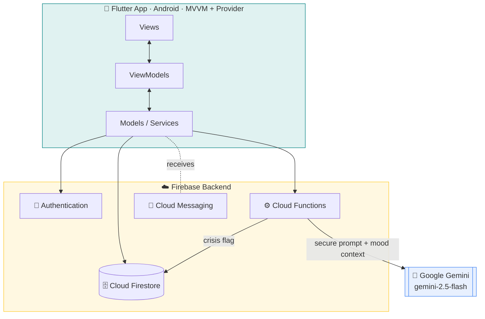
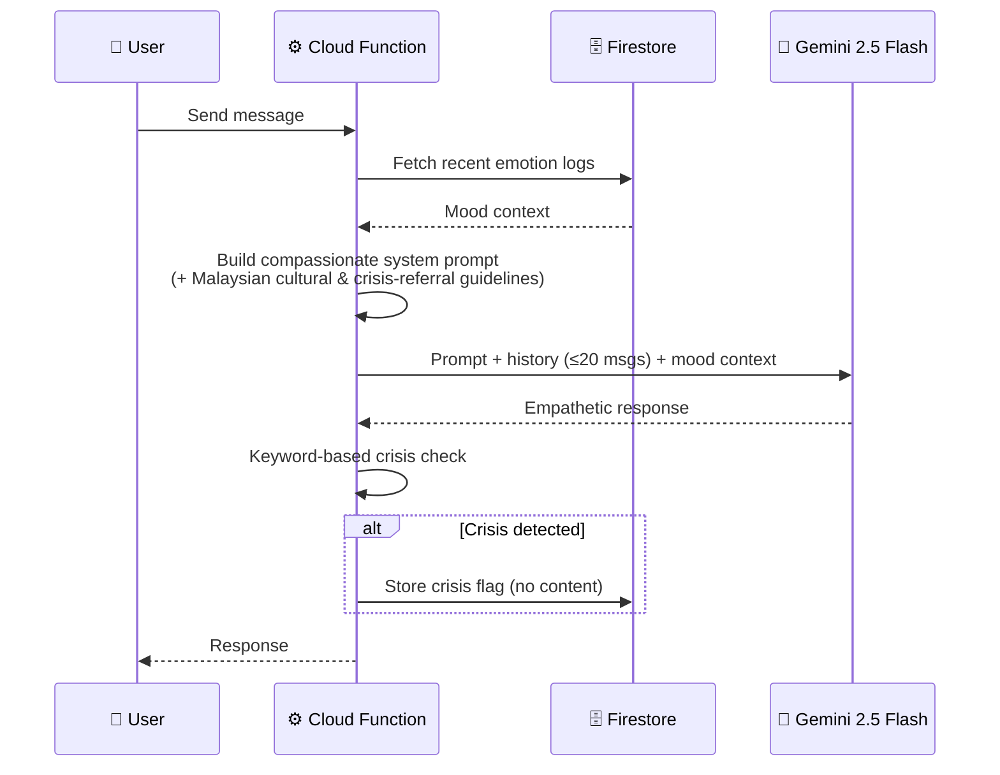

<div align="center">

# 🧠 MindMate

### *A Flutter-Based Mental Health App for University Students*
#### Emotion Tracking · AI-Powered Virtual Assistant · Gamified Self-Care

<br/>


<br/>

> *Anonymous, non-judgmental, and personalized emotional support — bridging the gap between formal mental health services and the everyday emotional needs of students.*

</div>

---

## 📑 Table of Contents

- [Why MindMate?](#-why-mindmate)
- [Key Features](#-key-features)
- [Architecture at a Glance](#-architecture-at-a-glance)
- [The 18 Use Cases](#-the-18-use-cases-by-module)
- [Data Model](#-data-model-firestore-collections)
- [How the AI Assistant Works](#-how-the-ai-assistant-works)
- [Tech Stack](#-tech-stack)
- [Getting Started](#-getting-started)
- [Testing & Results](#-testing--results)
- [Project Objectives](#-project-objectives)
- [Scope & Limitations](#%EF%B8%8F-scope--limitations)
- [Roadmap](#-roadmap-future-improvements)
- [About](#-about)

---

## 💡 Why MindMate?

University students face constant academic and personal stressors, yet formal counselling is often slow, stigmatized, or intimidating to approach. MindMate offers a **stigma-free, always-available** companion that encourages proactive mental-health habits.

By combining **real-time emotion monitoring**, an **AI-based support coach**, and **gamified self-care exercises**, MindMate fosters self-reflection and emotional awareness in an approachable, interactive space — without ever claiming to replace professional care.

<table>
<tr>
<td width="33%" align="center">

### 📊
**Track**
<br/>Log daily moods and watch trends unfold over weeks and months.

</td>
<td width="33%" align="center">

### 🤖
**Talk**
<br/>Chat with an empathetic AI assistant that knows your recent mood context.

</td>
<td width="33%" align="center">

### 🎮
**Grow**
<br/>Build streaks, earn badges, and unlock avatars through self-care.

</td>
</tr>
</table>

---

## ✨ Key Features

<details open>
<summary><b>📝 Emotion Tracking</b></summary>

- **Daily mood check-in** with 5 emotion states — 😊 Happy, 😌 Calm, 😰 Anxious, 😢 Sad, 😠 Angry
- **Intensity scale** from 1–5, plus an optional free-text note (with sentiment scoring)
- **One entry per day** to encourage honest, reflective check-ins
- **Monthly calendar view** with mood filtering to browse and revisit past entries
- **Emotion insights** — dominant emotion, average mood score, and trend direction (improving / declining / stable) across week, month, or 3-month ranges
- **Instant self-care recommendation** tailored to the emotion you just logged

</details>

<details>
<summary><b>🧘 Self-Care Activities</b></summary>

Six guided wellness activities:

| Activity | Focus |
|---|---|
| Box Breathing | Timed breathing cycles |
| Guided Journaling | Reflective writing prompts |
| Progressive Muscle Relaxation | Step-by-step tension release |
| Mindful Body Scan | Grounding awareness |
| Gratitude Reflection | Positive reframing |
| Positive Affirmations | Confidence building |

Completing an activity for the first time each day earns points and can unlock milestone achievements.

</details>

<details>
<summary><b>🤖 AI Virtual Assistant</b></summary>

- Powered by **Google Gemini (`gemini-2.5-flash`)** through a secure Firebase Cloud Function
- Maintains **conversation history** (up to 20 messages) for natural, continuous chats
- Builds a **mood context** from your recent emotion logs to personalize responses
- Offers **coping strategies, motivational support, and journaling prompts**
- **Server-side crisis detection** raises a privacy-preserving flag to administrators — without storing conversation content

</details>

<details>
<summary><b>🎮 Gamification</b></summary>

- **Streak counter** rewarding consistent daily logging
- **Badges & achievement points** for milestones (streaks, activity completions, breathing goals)
- **Avatar customization** — purchase and equip avatars with earned points
- Server-side **badge deduplication** ensures achievements are awarded exactly once

</details>

<details>
<summary><b>🔔 Notifications</b></summary>

- Reminder and system notifications delivered via **Firebase Cloud Messaging (FCM)**
- Configurable **notification preferences** and reminder times

</details>

<details>
<summary><b>🛡️ Administration Panel</b></summary>

- **Dashboard** — platform statistics, chatbot-usage card, and a crisis queue with acknowledge actions
- **User management** — search, create, enable/disable, delete accounts, and send password-reset links
- **Emotional-risk analytics** — risk-scored user list with per-user mood-report export
- **Report generation** — usage, engagement, and emotional analytics

</details>

---

## 🏗 Architecture at a Glance

MindMate follows the **MVVM pattern with Provider** for state management, over a **Firebase** backend. A crucial design decision keeps sensitive operations — including the **Gemini API key** — entirely **off the device** inside Firebase Cloud Functions.



> 🔒 **Security by design:** The API key and system prompt live only on the server. Crisis detection runs server-side and stores a flag — never the conversation itself.

---

## 🗂 The 18 Use Cases (by Module)

<details>
<summary><b>🔐 Authentication & User Account</b> — UC001–UC004</summary>

| ID | Use Case | Description |
|----|----------|-------------|
| UC001 | Sign In | Users (Google or email/password) and admins (email/password) log in |
| UC002 | Register Account | New users create an account |
| UC003 | Reset Password | Recover and reset forgotten credentials |
| UC004 | Manage Profile | View/update profile and complete first-time setup |

</details>

<details>
<summary><b>📝 Emotion Tracking</b> — UC005–UC007</summary>

| ID | Use Case | Description |
|----|----------|-------------|
| UC005 | Record Daily Emotion | Daily mood check-in with state, intensity, and notes |
| UC006 | View Emotion History | Review/filter past entries via a monthly calendar |
| UC007 | View Emotion Insights | Analytics, trends, and summaries from mood data |

</details>

<details>
<summary><b>🧘 Self-Care Activities</b> — UC008–UC009</summary>

| ID | Use Case | Description |
|----|----------|-------------|
| UC008 | Browse Self-care Activities | Explore available wellness activities |
| UC009 | Participate in Self-care Activities | Engage in an activity and record completion |

</details>

<details>
<summary><b>🤖 AI Virtual Assistant</b> — UC010</summary>

| ID | Use Case | Description |
|----|----------|-------------|
| UC010 | Interact with AI Assistant | Chat for emotional support, guidance, and reflection |

</details>

<details>
<summary><b>🎮 Gamification</b> — UC011–UC012</summary>

| ID | Use Case | Description |
|----|----------|-------------|
| UC011 | View Achievements | View earned badges and track points and streak |
| UC012 | Manage Avatar Customization | Purchase, equip, and manage avatars |

> ℹ️ *Naming note: the design docs (SRS/SDD) label UC011 "**View Achievements**", while the test documentation refers to it as "**Track Achievements**." Worth aligning before the viva.*

</details>

<details>
<summary><b>🔔 Notifications</b> — UC013–UC014</summary>

| ID | Use Case | Description |
|----|----------|-------------|
| UC013 | Manage Notifications | View, read, and manage received notifications |
| UC014 | Manage Notification Preferences | Configure reminders and notification settings |

</details>

<details>
<summary><b>🛡️ Administration</b> — UC015–UC018</summary>

| ID | Use Case | Description |
|----|----------|-------------|
| UC015 | View Administrative Dashboard | System statistics and platform overview |
| UC016 | Manage User Accounts | Search, view, and monitor user accounts |
| UC017 | Monitor User Emotional Risks | Identify high-risk users and review trends |
| UC018 | Generate Reports | Reports on usage, engagement, and emotional analytics |

</details>

---

## 🗄 Data Model (Firestore Collections)

| Collection | Purpose |
|---|---|
| `users` | Core profile, role, account status, and settings |
| `emotion_logs` | Daily mood entries with intensity and note sentiment |
| `chatbot_sessions` | AI assistant conversation history |
| `activities` | Self-care activity catalogue |
| `gamification_history` | Points, badges, and achievement records |
| `notifications` | System and reminder notifications |
| `crisis_flags` | Privacy-preserving crisis alerts for admins |
| `admin_settings` | Platform configuration |
| `counters` | Sequential ID generation (e.g. `User0001`) |
| `ai_assistants` | Assistant configuration data |

> 💡 A Cloud Function assigns each new user a human-readable **`displayId`** (like `User0001`) automatically — authentication credentials are handled by Firebase and never stored in the model.

---

## 🤖 How the AI Assistant Works



---

## 🛠 Tech Stack

| Layer | Technology |
|---|---|
| **Frontend** | Flutter · Dart |
| **Architecture** | MVVM + Provider |
| **Auth** | Firebase Authentication (Google & email/password) |
| **Database** | Cloud Firestore |
| **Serverless** | Firebase Cloud Functions |
| **Push** | Firebase Cloud Messaging (FCM) |
| **AI** | Google Gemini `gemini-2.5-flash` |
| **Platform** | Android |
| **Methodology** | Plan-driven, with UML during requirements & design |

---

## 🚀 Getting Started

> ⚠️ *The commands below are standard Flutter + Firebase setup steps to get you running — adjust project IDs, paths, and config to match your own environment.*

**Prerequisites**
- Flutter SDK & Dart
- A Firebase project with Authentication, Firestore, Cloud Functions, and Cloud Messaging enabled
- Firebase CLI
- A Google Gemini API key (stored **server-side** in Cloud Functions config — never in the app)

**Setup**

```bash
# 1. Clone the repository
git clone <your-repo-url>
cd mindmate

# 2. Install Flutter dependencies
flutter pub get

# 3. Connect your Firebase project
flutterfire configure

# 4. Deploy Cloud Functions (includes the Gemini integration)
cd functions
npm install
firebase deploy --only functions

# 5. Run the app on an Android device or emulator
cd ..
flutter run
```

---

## 🧪 Testing & Results

MindMate was validated through **three levels of testing**:

<table>
<tr>
<td width="33%" valign="top">

### ⬛ Black-box
**100% pass rate**
<br/>All **38 test scenarios** across **18 use cases** produced expected outputs, with clear, user-friendly error messages.

</td>
<td width="33%" valign="top">

### ⬜ White-box
**4 core logic paths verified**
<br/>Negative mood trend · emotion streak · badge deduplication · wellbeing score computation.

</td>
<td width="33%" valign="top">

### 👥 User Acceptance
**n = 3 students**
<br/>Positive reception, especially for the chatbot's empathetic tone and the motivating gamification.

</td>
</tr>
</table>

**UAT Average Ratings** (out of 5)

| Dimension | Rating |
|---|:---:|
| Ease of Use | ⭐ 4.6 |
| Visual Clarity | ⭐ 4.4 |
| Usefulness of AI Chatbot | ⭐ 4.2 |
| **Overall Satisfaction** | **⭐ 4.5** |

> Participants praised the emoji-based mood calendar and the consistent teal-blue palette, and appreciated multi-message chatbot conversations. Requested future additions: dark mode and editable emotion notes.

---

## 🎯 Project Objectives

1. **Analyze** the requirements for developing MindMate ✅
2. **Design** the app with an emotion-tracking feature for identifying, monitoring, and reflecting on emotional states ✅
3. **Implement** an AI-driven virtual assistant offering personalized coping mechanisms, motivational support, and writing prompts ✅
4. **Evaluate** the app's effectiveness in helping students manage stress and improve emotional awareness ✅

All four objectives were achieved, with the system passing testing and receiving positive user acceptance.

---

## ⚠️ Scope & Limitations

MindMate is intentionally scoped as a **supportive companion, not a clinical tool.**

- ✅ Runs on **Android** (built with Flutter)
- ✅ Five emotion states with 1–5 intensity, one entry per day
- ✅ Weekly summaries and mood-curve plotting
- ✅ Streaks and badges for engagement
- ❌ Does **not** provide medical diagnosis or treatment
- ❌ Does **not** replace licensed therapists or mental-health professionals
- ❌ Does **not** offer real-time human chat support

**Known evaluation constraints:** the UAT sample was small (**n = 3**), the app is **Android-only**, and quantitative performance/reliability targets were not backed by instrumented benchmarking data.

---

## 🔮 Roadmap (Future Improvements)

- 🌙 Dark mode support
- ✏️ Editable emotion notes after submission
- 📈 Larger-scale user testing and instrumented performance benchmarking
- 📱 Potential cross-platform (iOS) expansion

---

## 👩‍💻 About

**MindMate** was developed as a Final Year Project (PSM2 / SECJ 4134) for the **Bachelor of Computer Science (Software Engineering)** at the **Faculty of Computing, Universiti Teknologi Malaysia (UTM)**.

- **Developer:** Lau Yun Xi
- **Supervisor:** Ts. Dr. Johanna Binti Ahmad
- **Institution:** Universiti Teknologi Malaysia (UTM)

<div align="center">

<br/>

*Built with 💙 to help students feel a little more seen.*

</div>
